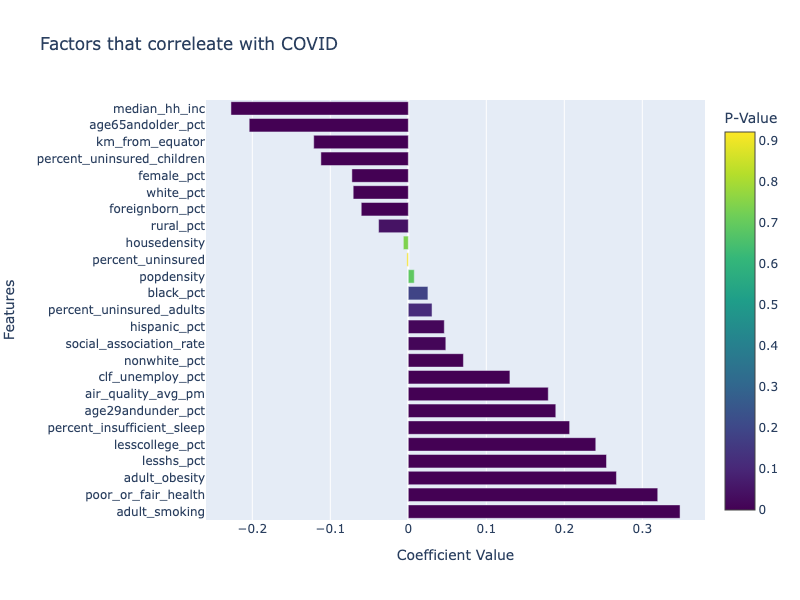
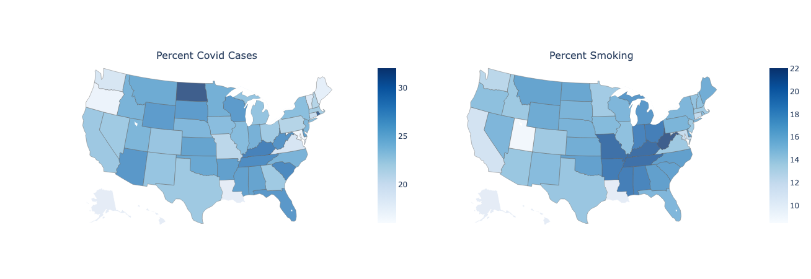
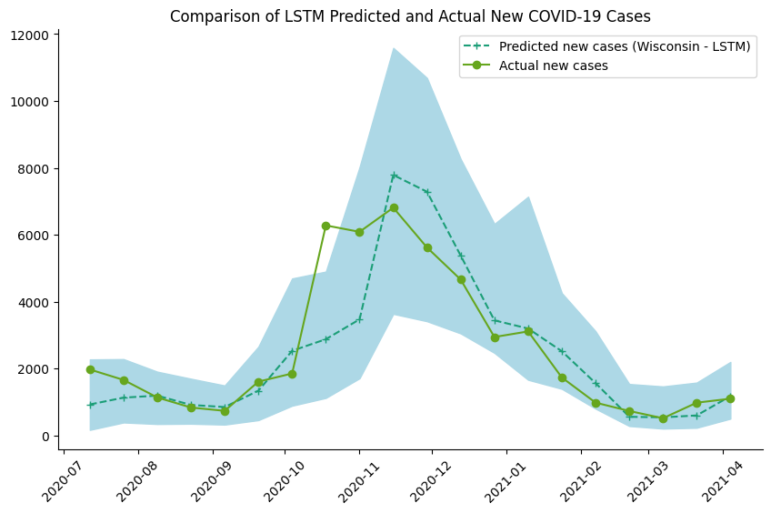

# Forcasting COVID 19

The goal of this project is to forecast the incidence of COVID-19 cases. Data curated by [JHU CSSE](https://github.com/CSSEGISandData/). This project is an extension of UMich Masters of Applied Data Science: Health Analytics Coursework.

## Content

  1. Inspect correlations between demographic factors and COVID-19 prevelance

  2. Implement LSTM model for COVID-19 forecasting and evaluate on state and county-level data

  3. Visualize the performance of model trained on county-level data

## Highlights

### Factors that correleate with COVID-19

Smoking is the factor most positvely corrleated with covid cases, followed by poor health and obesity. Conversely, median household income negatively correlates with covid.

  

### Map of Cases
We can plot the ratio of cases in comparision to smokers:

  

### LSTM model for COVID-19 forecasting

We implement elements of the model explained in the paper: [A spatiotemporal machine learning approach to forecasting
COVID-19 incidence at the county level in the United States](https://arxiv.org/pdf/2109.12094.pdf).

  

The prediction intereval is widest around November 2020.

Unlike the paper we will did not implement an ensemble but only one model. This is something for future work along with comparision to more traditional time series models such as ARIMA.